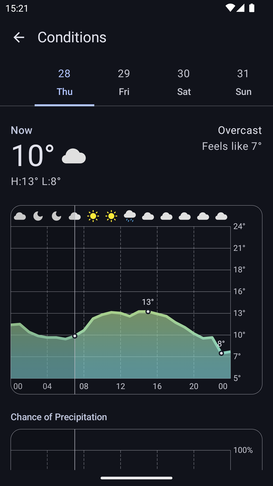
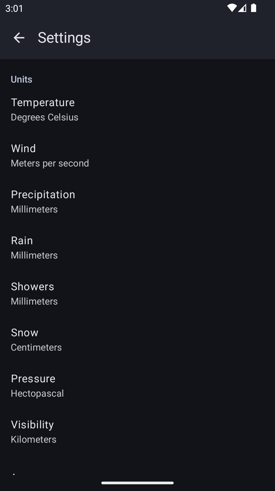

# Bura
Modern weather app with graphs and thoughtful data visualization. Spiritual successor to [Prognoza](https://github.com/davidtakac/prognoza).

    
    
    

## Screenshots

    
    
    

    
    
    

## Features
Bura transforms and visualizes weather data from Open-Meteo.com to give you essential weather information at a glance, while allowing you to dive deeper with graphs.

Other features include:
- Works offline
- Uses mobile data sparingly
- Does not require an API key
- Does not access your location
- Material Design 3 / Material You
- Dark and light theme
- Customizable measurement units

## Will be implemented
Sorted by priority:

1. Graphs
   1. ~~Precipitation~~
   2. UV index
   3. Wind
   4. Pressure
   5. Humidity
   6. Visibility
   7. Feels like
2. Air quality
   1. Home screen tiles
   2. Graphs
3. Weather alerts
4. Home screen widgets
5. Notification widgets
6. Customizable [Open-Meteo data sources](https://open-meteo.com/en/docs#data-sources)

## Will not be implemented
Issues requesting these features will be closed as not planned:

- Manual refresh
- Customizable refresh period
- Other weather sources
- OLED dark theme

## Translate
Translations will be managed with [Weblate](https://hosted.weblate.org/) if/when my libre hosting request is approved.

## Contribute
Open issues and/or pull requests targeting the `dev` branch.

## Donations
I do not accept donations at the moment. I tried to accept them on Prognoza, but as soon as I received the first donation, PayPal shut down my account.

## FAQ

### Meaning of the colored temperature bar?
Nicely explained by @LeftyDextrous in #28: 

> The extreme ends of the spectrum are the full temperature range of the week. The colored bar is the temperature range for that day, and the dot is the current temperature.

## Credit
- Forecast data by [Open-Meteo](https://open-meteo.com/) licensed under [Attribution 4.0 International (CC BY 4.0)](https://creativecommons.org/licenses/by/4.0/)  
- Location data by [Open-Meteo](https://open-meteo.com/) licensed under [Attribution 4.0 International (CC BY 4.0)](https://creativecommons.org/licenses/by/4.0/)  
- Sun, moon, sunrise and sunset icons adapted from [Feather icons](https://feathericons.com/)  licensed under the [MIT License](https://github.com/feathericons/feather/blob/main/LICENSE)  

## License
  
Bura is free software: you can redistribute it and/or modify it under the terms of the GNU General Public License as published by the Free Software Foundation, either version 3 of the License, or (at your option) any later version.