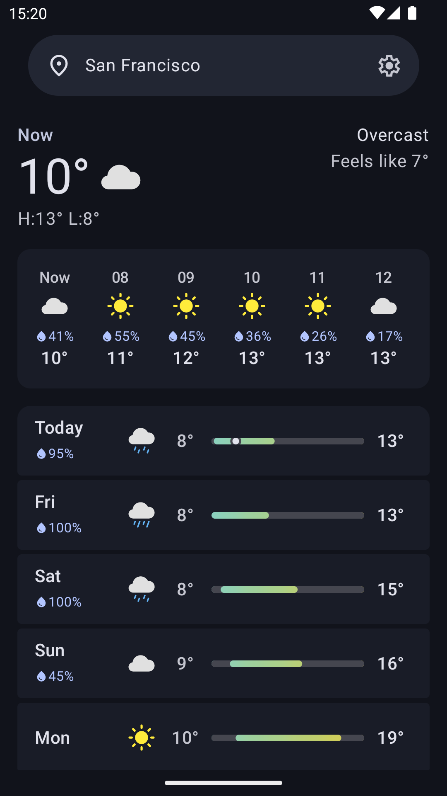
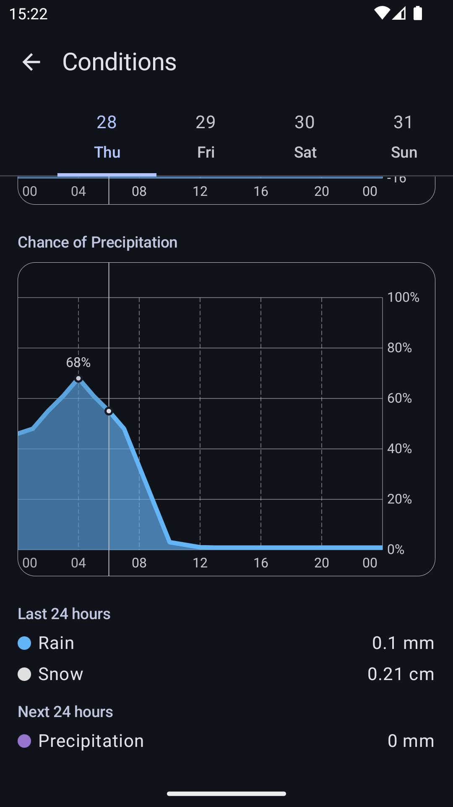
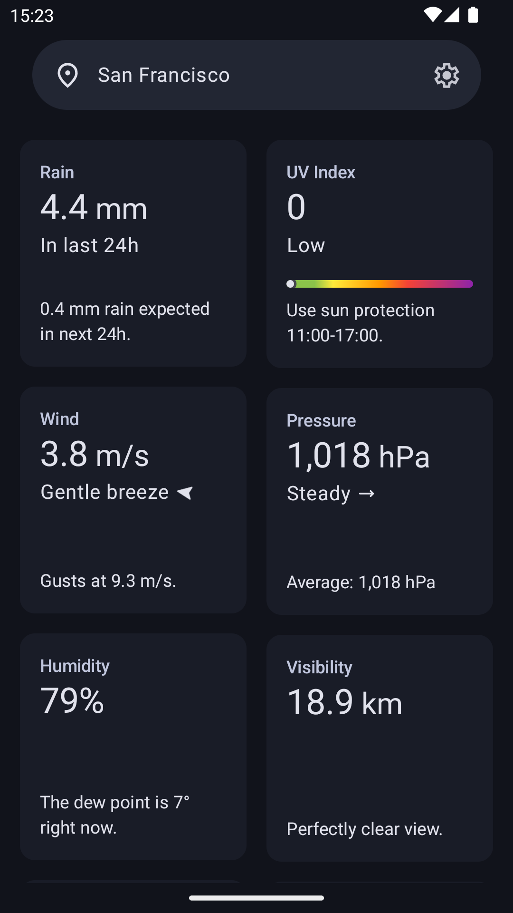
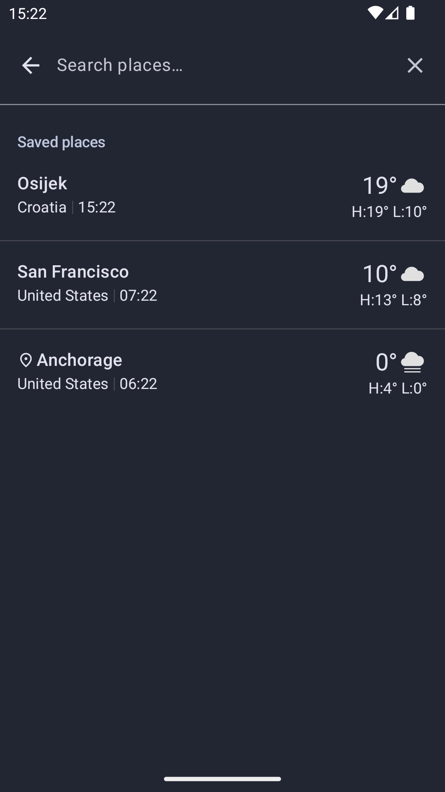
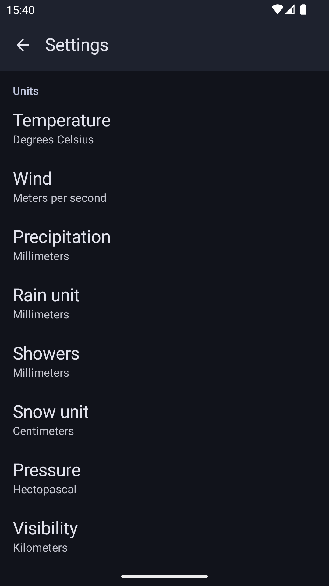

# Bura
A libre weather app with graphs that works offline. Spiritual successor to [Prognoza](https://github.com/davidtakac/prognoza).

## Screenshots

    
    
    

    
    
    

## Features
- Smart and concise home page
- Graphs for more details
- Works offline
- Customizable measurement units
- Dark and light theme
- Material 3

## Planned
- Graphs for precipitation, uv index, wind, pressure, humidity, visibility and feels like
- Air quality data and graphs
- Weather alerts
- F-Droid inclusion
- Customizable [Open-Meteo data sources](https://open-meteo.com/en/docs#data-sources)

## Not planned
- Widgets (life's too short)
- Weather sources other than Open-Meteo
- Manual refresh
- Customizable refresh period

## Translate
Translations will be managed with [Weblate](https://hosted.weblate.org/) once they approve my gratis project hosting request.

## Contribute
Open issues and/or pull requests targeting the `dev` branch.

## Donations
I do not accept donations at the moment. I tried to accept them on Prognoza, but as soon as I received the first donation, PayPal shut down my account.

## Why wasn't this an update to Prognoza?
- Bura is a complete rewrite that has nothing in common with Prognoza, except the dev :)
- Bura also looks completely different, and I figured some people might prefer Prognoza
- Prognoza's app ID is hr.dtakac.prognoza, but I don't own the domain
- Prognoza is licensed under the MIT License, which was a mistake
- Prognoza is written in KMM, which was also a mistake

## Credit
- Forecast data by [Open-Meteo](https://open-meteo.com/) licensed under [Attribution 4.0 International (CC BY 4.0)](https://creativecommons.org/licenses/by/4.0/)  
- Location data by [Open-Meteo](https://open-meteo.com/) licensed under [Attribution 4.0 International (CC BY 4.0)](https://creativecommons.org/licenses/by/4.0/)  
- Sun, moon, sunrise and sunset icons adapted from [Feather icons](https://feathericons.com/)  licensed under the [MIT License](https://github.com/feathericons/feather/blob/main/LICENSE)  

## License
  
Bura is free software: you can redistribute it and/or modify it under the terms of the GNU General Public License as published by the Free Software Foundation, either version 3 of the License, or (at your option) any later version.